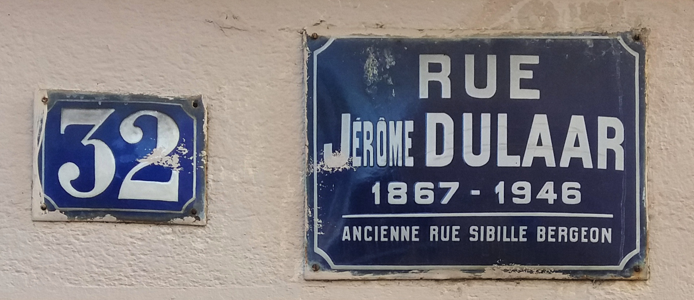

% Adresses dans OpenStreetMap
% Jérôme (colargol) & Michel (chimel38)
% 17 avril 2023

# Adresse

------------------

## En France

{ width=50% }

- Nom de voie
- Numéro
    - côtés pairs / impairs 
    - métrique (ruralité)
- Code Postal
- Commune

::: notes

- numérotation à l'initiative du maire
- cas de numéro zéro
- n° pairs et impairs sur un même côté. ex [Allée de l'île Gloriette](https://www.openstreetmap.org/?mlat=47.2109871&mlon=-1.5579879&zoom=13#map=19/47.21085/-1.55796)

:::    

------------------

## Dans OpenStreetMap

------------------

## Position du point adresse

- sur la rue
- sur le bâtiment
- cas des [CIDEX](https://fr.wikipedia.org/wiki/Adresse_postale#CIDEX){target="_blank"}
- [Schéma de Charlieu](https://wiki.openstreetmap.org/wiki/Le_Sch%C3%A9ma_de_Charlieu_:_une_proposition_autour_des_adresses){target="_blank"}

::: notes
Il n'y a pas de consensus sur ce que représente précisément une adresse dans OSM (ni ailleurs !) et à quoi elle se rapporte, cela peut être des éléments matériels (une entrée, un portail, une maison, un immeuble, une boite aux lettres) ou des éléments fonctionnels (une parcelle, une entreprise, un foyer, un domicile, une usine...). Il n'existe donc pas de schéma 1 adresse=1 foyer ou 1 adresse=1 domicile ou 1 adresse=1 commerce... Selon le service qui les utilise, l'adresse ne renverra pas aux mêmes objets, par exemple, les Finances Publiques se servent des adresses pour rattacher des foyers fiscaux tandis qu'un service comme La Poste va rapprocher les adresses à des lieux de livraisons comme une boite aux lettres ou une porte d'entrée. 

Schéma de Charlieu : proposition pour distinguer les adresses physiques et les adresses de contact

:::

------------------

## Tags

[Point adresse (addr:)](https://wiki.openstreetmap.org/wiki/FR:Key:addr:*){target="_blank"}

| Item          | Clé             | 
|---------------|-----------------|
| **N° de rue** | addr:housenumber|  
| **Voie**      | addr:street     | 
| Lieu-dit      | addr:hamlet     |  
| Code postal   | addr:postcode   |
| Commune 	    | addr:city       |

::: notes
Les adresses se cartographient avec les étiquettes au préfixe [addr:](https://wiki.openstreetmap.org/wiki/FR:Key:addr:*){target="_blank"}

:::
------------------

Relation ["associated street"](https://wiki.openstreetmap.org/wiki/FR:Relation:associatedStreet){target="_blank"} - Tags

| Clé          | Valeur           | 
|--------------|------------------|
| **type**     | associatedStreet |
| **name**     | Nom de rue       |
| addr:suburb  | Nom du quartier  |

::: notes
addr:street=* permet de lier une rue et ses addr:housenumber=* à partir de leur proximité spatiale, ce lien peut être mis en évidence à l’aide d’une relation type=associatedStreet. 
:::

------------------

Relation ["associated street"](https://wiki.openstreetmap.org/wiki/FR:Relation:associatedStreet){target="_blank"} - Membres

| Chemin/nœud |	Rôle   | Description     |
|-------------|--------|-----------------|
| Chemin      | street | La rue associée |
| Chemin/nœud | house  | Numéros d’habitation |

::: notes

Cette méthode représente 5% d’adresses comparée à addr:street. 

La communauté est divisée sur l’usage de la relation. Un vote informel en 2015 a abouti à 49 votes favorables à sa dépréciation contre 50. 
:::

------------------

# Données publiques

------------------

## BANO

**Base Adresse Nationale Ouverte**

Initiée par OpenStreetMap France en 2014 en scrapant les adresses des planches cadastrales

------------------

## BAL

**Base Adresse Locale**

Depuis la loi 3DS de février 2022, chaque commune se doit, de créer, vérifier et certifier sa propre base adresse.

[Que va changer la loi 3DS pour les communes sur leurs adresses ?](https://adresse.data.gouv.fr/blog/que-va-changer-la-loi3ds-pour-les-communes-sur-leur-adresse){target="_blank"}

[Démo de l'outil "mes adresses"](https://mes-adresses.data.gouv.fr/new?demo=1){target="_blank"}

------------------

## BAN

**Base Adresse Nationale**

Constituée en réponse à la BANO en associant LaPoste, l’IGN, Etalab et OSM France

[https://adresse.data.gouv.fr/](https://adresse.data.gouv.fr/){target="_blank"}

[Article sur l'historique de la BAN](https://www.cairn.info/revue-reseaux-2021-1-page-151.htm){target="_blank"}

[La BAN, le film](https://ghost.adresse.data.gouv.fr/content/media/2022/06/Vide-oBANv6.mp4){target="_blank"}

------------------

# Intégration dans OSM

------------------

[À partir d'une BAL](https://www.openstreetmap.org/user/LySioS/diary/400528){target="_blank"}

[À partir de la BANO](https://wiki.openstreetmap.org/wiki/Contribuer_%C3%A0_la_BANO){target="_blank"}

------------------

## Liens

### Wikipedia

- [Adresse Postale (WP)](https://fr.wikipedia.org/wiki/Adresse_postale)
- [Numérotation des immeubles (WP)](https://fr.wikipedia.org/wiki/Num%C3%A9rotation_des_immeubles)
- [Adresses wiki OSM](https://wiki.openstreetmap.org/wiki/FR:Adresses)

------------------

## Liens

### Wiki OpenStreetMap
- [BANO](https://wiki.openstreetmap.org/wiki/FR:France/Base_Adresses_Nationale_Ouverte_(BANO))
- [Key:addr](https://wiki.openstreetmap.org/wiki/FR:Key:addr:*)
- Relation ["associated street"](https://wiki.openstreetmap.org/wiki/FR:Relation:associatedStreet)
- [Schéma de Charlieu](https://wiki.openstreetmap.org/wiki/Le_Sch%C3%A9ma_de_Charlieu_:_une_proposition_autour_des_adresses)
- [Adresses des POI et “contact:” ](https://forum.openstreetmap.fr/t/adresses-des-poi-et-contact/7493)

------------------

## Liens

### Blogs

- [Adressage, trop d'la BAL ? (LySioS) ](https://www.openstreetmap.org/user/LySioS/diary/400528)
- [Historique de la BAN](https://www.cairn.info/revue-reseaux-2021-1-page-151.htm)

------------------

## Crédits

[Photo de la plaque de rue Jérôme Dulaar](https://commons.wikimedia.org/wiki/File:Lyon_4e_-_Rue_J%C3%A9r%C3%B4me_Dulaar_-_Plaque_ancienne_rue_Sibille_Bergeon_(crop).jpg) : Romain Behar et Jérôme Villafruela - CC0

### Présentation 

[Présentation en ligne sur https://jvillafruela.github.io/](https://jvillafruela.github.io/presentation-adresses-osm/adresses-osm.html)

[Sources](https://github.com/JVillafruela/jvillafruela.github.io/presentation-adresses-osm/)

Licence [CC-BY-SA 3.0](https://creativecommons.org/licenses/by-sa/3.0/fr/)

